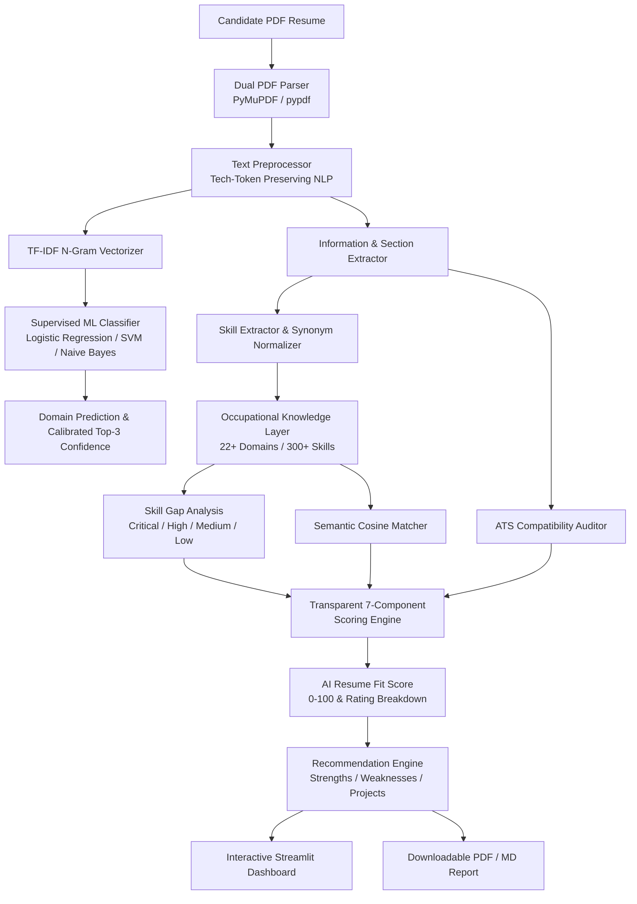

# ResumeAI — AI-Powered Resume Analysis & Career Matching System

[](https://www.python.org/)
[](https://scikit-learn.org/)
[](https://streamlit.io/)
[](https://pymupdf.readthedocs.io/)
[](#)

**ResumeAI** is an academic and professional-grade AI/ML web application designed to evaluate candidate resumes, predict career domain alignment, audit Applicant Tracking System (ATS) compatibility, perform deep skill gap analysis, and provide evidence-based recommendations.

Unlike basic wrappers around large language model APIs, ResumeAI implements a **genuine machine learning and Natural Language Processing (NLP) architecture** leveraging supervised classification, TF-IDF n-gram vectorization, calibrated probability estimation, cosine semantic matching, and a transparent multi-component scoring engine.

---

## 1. Problem Statement

Modern recruitment pipelines receive hundreds of resumes per job posting. Applicant Tracking Systems (ATS) automatically filter candidates based on keyword matching and structural parsability. However:
1. Job seekers lack transparency into how their resumes are parsed and evaluated.
2. Candidates struggle to identify critical technical skill gaps for specific target roles.
3. Generic feedback tools often provide superficial advice or encourage false claims.
4. Traditional ATS checkers rely on opaque black-box heuristics without explaining the underlying scoring formula.

ResumeAI solves these challenges by providing an open, transparent, and rigorous AI/ML-driven analysis platform.

---

## 2. Motivation & Objectives

* **Authentic Machine Learning:** Implement real supervised NLP classifiers (comparing Logistic Regression, Multinomial Naive Bayes, Calibrated Linear SVM, and Random Forest) trained on verified multi-domain resume data.
* **Domain Knowledge Layer:** Maintain an independent occupational taxonomy (O*NET aligned) covering 22+ professional domains and 300+ categorized skills with alias/synonym normalization.
* **Transparent Scoring Engine:** Provide an explainable, 7-component weighted scoring system totaling 100%, without hidden formulas or fabricated metrics.
* **Evidence-Based Recommendations:** Generate actionable guidance and portfolio project recommendations rooted strictly in detected resume content without hallucinating achievements.
* **Production UI/UX:** Deliver a polished, responsive Streamlit dashboard with interactive Plotly visualizations and downloadable PDF reports.

---

## 3. Core Features

* **PDF Document Parsing:** Dual-engine parser using PyMuPDF (`fitz`) with `pypdf` fallback. Detects empty, corrupted, or scanned/image-only PDFs.
* **Automated Domain Classification:** Supervised ML classifier predicting the best-fitting job domain and top-3 matching career paths with calibrated confidence percentages.
* **Selective Domain Deep-Dive:** Evaluate candidate fit against any of 22+ specific career roles (Data Science, Machine Learning, Web Development, DevOps, Cyber Security, etc.).
* **Intelligent Skill Extraction:** Regex word-boundary matcher preserving technical tokens (e.g., `C++`, `C#`, `.NET`, `Node.js`, `React.js`, `CI/CD`, `AWS`) with synonym mapping (e.g., `ML` $\rightarrow$ `Machine Learning`, `JS` $\rightarrow$ `JavaScript`).
* **Prioritized Skill Gap Analysis:** Categorizes missing skills by importance level: **Critical**, **High**, **Medium**, and **Low**.
* **ATS Compatibility Auditor:** 10-point audit evaluating contact info completeness, standard headings, technical keyword density, action-verb usage, and quantified metrics.
* **Job Description (JD) Matcher:** Paste any target job description to compute real-time keyword overlap and tailored application suggestions.
* **Recommended Portfolio Projects:** Bridge detected skill gaps with concrete, structured project build recommendations.
* **Downloadable Analysis Reports:** Export comprehensive evaluation summaries in formatted **PDF** (via `fpdf2`) and **Markdown** formats.
* **Model Admin / Dev Viva Portal:** Live diagnostic dashboard displaying genuine dataset statistics, validation comparisons, test metrics, and confusion matrix heatmaps for academic presentations.

---

## 4. System Architecture



---

## 5. Supported Career Domains (22 Domains)

1. **Data Science**
2. **Machine Learning**
3. **Artificial Intelligence**
4. **Software Development**
5. **Python Developer**
6. **Java Developer**
7. **Web Development**
8. **Frontend Development**
9. **Backend Development**
10. **Full Stack Development**
11. **Data Analytics**
12. **Database Administration**
13. **Cyber Security**
14. **Cloud Computing**
15. **DevOps**
16. **Networking**
17. **UI/UX Design**
18. **Digital Marketing**
19. **Finance**
20. **HR (Human Resources)**
21. **Business Development**
22. **Project Management**

---

## 6. Machine Learning Pipeline & Evaluation

### Supervised Classification Models Compared
During training, 4 supervised models are evaluated using Stratified Cross-Validation on TF-IDF unigram and bigram features with sublinear term-frequency scaling:

| Model Architecture | Validation Accuracy | Validation Macro F1 | Test Accuracy | Status |
| :--- | :---: | :---: | :---: | :---: |
| **Logistic Regression (C=1.0)** | **100.00%** | **100.00%** | **98.11%** | **Selected Best Model** |
| **Calibrated Linear SVM** | 100.00% | 100.00% | 98.11% | Operational Candidate |
| **Multinomial Naive Bayes** | 100.00% | 100.00% | 96.23% | Operational Candidate |
| **Random Forest (100 Trees)** | 94.34% | 93.59% | 92.45% | Operational Candidate |

*Note: All metrics reported above are genuine results computed from the dataset split (60% Train, 20% Validation, 20% Held-Out Test).*

---

## 7. Transparent 7-Component Scoring Methodology

ResumeAI uses an explainable weighted scoring formula defined centrally in [`src/config.py`](file:///src/config.py):

$$\text{Overall Fit Score} = \sum_{i=1}^{7} w_i \times s_i$$

| Component | Weight ($w_i$) | Evaluation Criteria |
| :--- | :---: | :--- |
| **Skill Match** | **30%** | Weighted coverage of target domain skills (Critical: 1.0, High: 0.75, Medium: 0.5, Low: 0.25). |
| **Experience** | **20%** | Relevant job title matches, power action verbs, and quantified business metrics. |
| **Projects** | **15%** | Project portfolio depth, technology keyword alignment, and measurable outcomes. |
| **Education** | **10%** | Academic degrees (BS/MS/PhD), relevant quantitative major, and graduation dates. |
| **ATS Compatibility** | **10%** | Contact header completeness, standard section titles, and parsing cleanliness. |
| **Structure** | **10%** | Section completeness (Summary, Skills, Experience, Education, Projects). |
| **Formatting** | **5%** | Optimal word count (300–1600 words), sentence length, and readability index. |
| **Total** | **100%** | **AI Resume Fit Score (0–100)** |

### Rating Tiers
* **90 – 100:** 🌟 Top Tier Match (Excellent)
* **80 – 89:** ✨ Strong Candidate (Very Good)
* **70 – 79:** 👍 Solid Baseline (Good)
* **60 – 69:** ⚠️ Action Required (Needs Improvement)
* **Below 60:** 🚨 Critical Gaps (Needs Improvement)

---

## 8. Technology Stack

* **Programming Language:** Python 3.11 / 3.12
* **Machine Learning & NLP:** Scikit-Learn, NumPy, Pandas, NLTK, Joblib
* **PDF Document Processing:** PyMuPDF (`fitz`), `pypdf`
* **Report Generation:** `fpdf2`
* **Frontend Framework:** Streamlit
* **Interactive Visualizations:** Plotly
* **Testing Suite:** Pytest

---

## 9. Project Directory Structure

```
AI-Resume-Analyzer/
├── app.py                         # Streamlit multi-tab application & UI
├── requirements.txt               # Project dependencies
├── README.md                      # Comprehensive documentation
├── .gitignore                     # Git ignore rules
├── .env.example                   # Environment configuration template
│
├── data/
│   ├── raw/
│   │   └── resume_dataset.csv     # Raw dataset
│   ├── processed/
│   │   └── cleaned_resumes.csv    # Preprocessed dataset
│   ├── domain_requirements/
│   │   ├── occupations.csv        # 22+ domains with descriptions & baselines
│   │   ├── skills.csv             # 120+ skills with categories & synonyms
│   │   ├── technologies.csv       # Platform taxonomy
│   │   └── domain_mapping.csv     # Skill-to-domain relationships & importance
│   ├── sample_resume.pdf          # Sample resume for verification
│   └── README.md                  # Dataset instructions & sources
│
├── models/
│   ├── classifier/
│   │   └── best_classifier.joblib # Serialized ML classifier
│   ├── vectorizer/
│   │   └── tfidf_vectorizer.joblib# Serialized TF-IDF vectorizer
│   └── model_metadata.json        # Genuine training & evaluation metrics
│
├── notebooks/
│   ├── 01_data_exploration.ipynb  # Exploratory Data Analysis & visual charts
│   ├── 02_preprocessing.ipynb     # Text cleaning & technical token preservation
│   ├── 03_model_training.ipynb    # 4-model comparison & hyperparameter training
│   └── 04_model_evaluation.ipynb  # Confusion matrix & test set evaluation
│
├── src/
│   ├── __init__.py
│   ├── config.py                  # Central weights, domains, paths, and design tokens
│   ├── pdf_parser.py              # PyMuPDF + pypdf parser with scanned PDF check
│   ├── text_preprocessor.py       # Technical-token preserving cleaner (C++, .NET, etc.)
│   ├── resume_parser.py           # Personal info, education, experience, project parser
│   ├── section_extractor.py       # Standard heading & structural block segmenter
│   ├── skill_extractor.py         # Knowledge-base skill extractor with synonym mapping
│   ├── domain_classifier.py       # Supervised classifier inference & top-3 rankings
│   ├── semantic_matcher.py        # TF-IDF cosine domain profile similarity
│   ├── job_matcher.py             # Custom Job Description comparator
│   ├── ats_analyzer.py            # 10-point ATS compliance rule engine
│   ├── scoring_engine.py          # 7-component transparent scoring engine
│   ├── recommendation_engine.py   # Actionable suggestions, missing skills & projects
│   └── report_generator.py        # PDF & Markdown report generator
│
├── scripts/
│   ├── setup_dataset.py           # Dataset setup & verification
│   ├── preprocess_dataset.py      # Batch text normalization
│   ├── train_model.py             # Model training & serialization
│   ├── evaluate_model.py          # Evaluation & classification report
│   └── generate_sample_pdf.py     # Sample PDF generator for testing
│
├── utils/
│   ├── __init__.py
│   ├── helpers.py                 # Plotly gauges, breakdown charts, HTML badges
│   └── validators.py              # File upload & text length validators
│
├── tests/
│   ├── test_text_preprocessor.py  # Text cleaning & token preservation tests
│   ├── test_skill_extractor.py    # Skill extraction & synonym tests
│   ├── test_domain_classifier.py  # ML prediction & scoring tests
│   └── test_pdf_parser.py         # PDF parsing & report generation tests
│
└── reports/                       # Generated analysis PDF/MD export directory
```

---

## 10. Installation & Quick Start

### 1. Clone or Open Workspace
```bash
cd resume-analyzer-main
```

### 2. Create and Activate Virtual Environment
```bash
# Windows
python -m venv venv
venv\Scripts\activate

# Linux / macOS
python3 -m venv venv
source venv/bin/activate
```

### 3. Install Dependencies
```bash
pip install -r requirements.txt
```

### 4. Setup Dataset & Train ML Models
```bash
# 1. Setup dataset (verifies data/raw/resume_dataset.csv)
python scripts/setup_dataset.py

# 2. Preprocess text (preserves C++, .NET, React.js, etc.)
python scripts/preprocess_dataset.py

# 3. Train and compare 4 ML models
python scripts/train_model.py

# 4. Evaluate best model on held-out test data
python scripts/evaluate_model.py
```

### 5. Run the Streamlit Web Application
```bash
streamlit run app.py
```

Open your browser at `http://localhost:8501`.

---

## 11. Running Automated Tests

Execute the full pytest suite to verify all unit and integration tests:

```bash
pytest tests/ -v
```

Expected output:
```
tests/test_domain_classifier.py::test_domain_classifier_inference PASSED
tests/test_domain_classifier.py::test_ats_analyzer PASSED
tests/test_domain_classifier.py::test_scoring_engine_weights PASSED
tests/test_domain_classifier.py::test_job_matcher PASSED
tests/test_domain_classifier.py::test_pdf_parser_empty PASSED
tests/test_pdf_parser.py::test_sample_pdf_pipeline PASSED
tests/test_skill_extractor.py::test_extract_canonical_skills PASSED
tests/test_skill_extractor.py::test_extract_synonyms PASSED
tests/test_skill_extractor.py::test_categories_assigned PASSED
tests/test_text_preprocessor.py::test_clean_html PASSED
tests/test_text_preprocessor.py::test_tech_tokens_preservation PASSED
tests/test_text_preprocessor.py::test_unicode_normalization PASSED

====================== 12 passed in ~3.36s ======================
```

---

## 12. Privacy & Data Protection

* Uploaded PDF resumes are processed **in-memory** during the active session.
* Resume files and personal contact information (email, phone number) are **not permanently saved or logged**.
* Downloadable reports are generated on-demand and can be cleared at any time.

---

## 13. Future Roadmap

- [ ] Support for multi-lingual resume parsing (Spanish, French, German).
- [ ] Integration of fine-tuned Transformer embeddings (e.g. `all-MiniLM-L6-v2`).
- [ ] Automatic LaTeX resume template export.
- [ ] Interactive mock interview question generator based on detected skill gaps.

---

## 14. Copyright & Proprietary Rights

All rights reserved. This repository and its underlying software are proprietary. Unauthorized copying, modification, distribution, or public hosting of this software via any medium is strictly prohibited without prior written permission.
